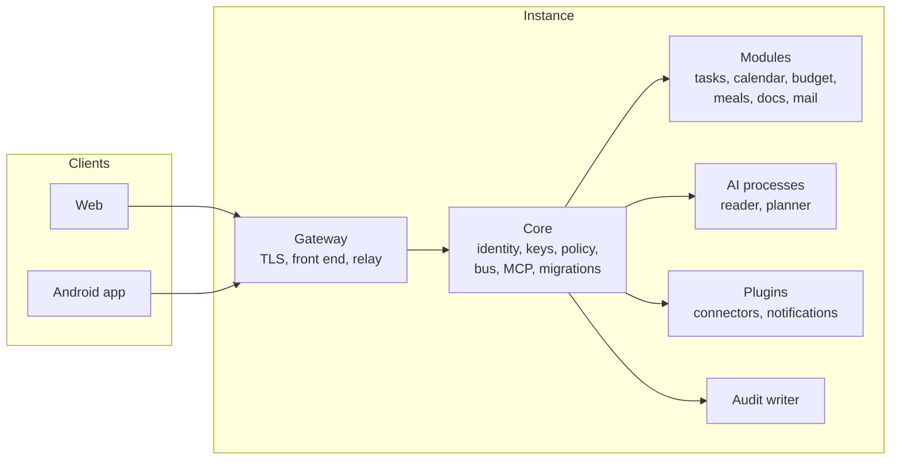

  <h1 align="center">Vilicus</h1>
  
<strong>A self-hosted, encrypted household orchestrator built in Rust, with an AI assistant that acts on your behalf</strong>

  
  
  
  
  

---

Vilicus is a personal orchestrator for a household: one installation serves one family (a single person, a couple, parents and children). Tasks, calendar, travel time, budget, meals and groceries, family procedures and an AI assistant share a single, encrypted data foundation, so you enter things once and every part of the system knows about them.

It is not a collaboration suite and not a product for companies. It is the missing foundation for a personal AI assistant: an assistant that only reads and advises is of limited use, one that can safely act (plan the week, build the shopping list, move an appointment, remind you of a forgotten reply) needs structured data to act on and strict rules about what it may do.

*Vilicus* was the steward of a Roman estate (the *villa*): the manager who ran the work, the stores and the accounts on behalf of the owner. Same job, for a modern household.

> **Status: design phase, no code yet.** This repository currently holds the vision, the architecture and the security documents. Everything listed below is a goal, not a shipped feature. See the [Roadmap](#roadmap). Design notes live in [`doc/`](doc/README.md).

## Key Features (planned)

### :house: One household, one foundation

- One instance covers one household, with a **partition per person** and a **shared household partition** (children, home, common tasks). A member's data is isolated by cryptographic keys, not by application logic
- Every module reads and writes through the same Core, so a planned recipe lands in the calendar, feeds the shopping list and the budget, and can remind you when it is time to cook
- Modules are independent: each one carries its own databases and its own migrations, and never reads another module's tables

### :lock: Security first

- **Encrypted at rest** with SQLCipher (AES-256). Keys are random data keys wrapped by several independent secrets: one per enrolled passkey (WebAuthn PRF when the authenticator supports it), a mandatory passphrase (Argon2id), and an offline recovery secret printed at enrollment. A copied disk is unreadable
- **Separate instance admin**: the admin runs the system but holds no data key and cannot reset a member's key. Losing every authenticator and the recovery secret loses that member's personal partition, by design
- **Not zero-knowledge, and honest about it**: the running Core holds unlocked keys in memory, so at-rest encryption protects against stolen disks and backups, not against a compromised running host
- **Passkeys by default** as second factor; TOTP only as a login fallback, never for confirmations. Devices are paired by QR code, validation code and a 24 hour delay before they can confirm anything sensitive
- **Tamper-evident audit log** of every action, including every action taken by the assistant, with its head hash anchored on your devices
- **Transport**: TLS 1.3 with a hybrid X25519 plus ML-KEM key exchange when both the client and the TLS terminator support it. Signatures and WebAuthn remain classical, and a third-party reverse proxy that terminates TLS removes the end-to-end benefit. No claim of quantum safety is made
- Written [threat model](doc/threat-model.md) from day one, no home-made cryptography, audited libraries only, minimal dependencies in the Core, signed releases

### :robot: An assistant that can act, safely

- Native **MCP server**: any MCP-capable assistant drives Vilicus with the authority the task needs and no more
- **The model is an untrusted component.** It proposes typed actions; deterministic code in the Core validates them against policy. It never holds keys or credentials
- **Quarantined reader and privileged planner**: the component that reads untrusted mail or web content returns only closed enums, bounded numbers and opaque identifiers; the component with the tools never sees raw untrusted text
- **Capability tokens per task**, short-lived and scoped to a module and a partition, not a blanket "AI access"
- **Three action tiers plus human-only actions**: read, reversible write (journaled and undoable, with no effect on a third party), and tier 2 for anything irreversible or that reaches outside (payment, sending, answering an invitation, deletion, order). Tier 2 is confirmed only from a **paired native app** that displays the parameters and signs them with a hardware-bound key; the web client never confirms
- **Provenance (taint) on every record** of every module: content from a mail or a web page is untrusted, derived data inherits the most restrictive label, and promoting tainted data is itself a tier 2 action
- Hard limits (daily amounts, send quotas, loop detection), a daily digest of what the assistant wrote, and a kill switch that an injected session cannot trigger
- **Local models** for sensitive topics (budget questions stay on the machine). A small **alignment controller** running locally on structured state can remove friction from low-risk elevated writes; it never decides on untrusted text and never replaces a human confirmation of an irreversible action. Remote providers are optional connectors

### :bricks: Modules

- **Tasks**: kanban with checklists, personal and professional
- **Calendar**: personal and professional, connected to your existing accounts
- **Places and trips**: places of life and work, travel time and transport mode
- **Budget**: real personal budget management, imports from bank statements
- **Meals and groceries**: recipes, meal plan, stock, automatic shopping list, a cart prepared for you to validate, and the recipe delivered at the right moment
- **Family documentation**: procedures, task distribution, notes that can be promoted from a task into a durable page
- **Mail help**: important-topic alerts, forgotten replies, birthdays, local context

### :electric_plug: Connectors

- Mail and calendar through IMAP/SMTP with application passwords and CalDAV first; Gmail and Outlook through OAuth only with a client you create yourself, read-only by default
- AI providers through API (instance level) or subscription (user level), plus local models
- Outbound notifications through Telegram, Signal or WhatsApp plugins (no sensitive content; inbound messages never trigger actions), and audio output for voice
- Grocery-store connectors are **unofficial, community-style plugins** running in isolated, sandboxed processes with no keys, kept out of the Core (see [Disclaimer](#disclaimer))

### :iphone: Clients

- One responsive front end, three wrappers: **web** (wide-screen comfort for budget, tasks and calendar, short sessions, never confirms tier 2), **Android app** (blank until paired with an instance, hardware-bound key, QR scanning, content-free notifications), and a desktop shell later
- Devices are paired explicitly (QR code and validation codes)
- Public exposure is an explicit choice with a blocking warning, not a default

## Architecture

*Simplified. The full schemas (components, tier 2 confirmation flow, bootstrap and pairing, key lifecycle) are in [`doc/architecture.md`](doc/architecture.md).*

- **Core**: identity, authentication, key management, policy engine, capability tokens, internal event bus, module registry, migrations, MCP endpoint. The only component that holds keys
- **Gateway**: exposed and therefore low trust, with no keys. Serves the web client and the app API, relays pairing and confirmation traffic. It can delay or drop a confirmation, not forge one
- **Modules**: trusted crates compiled into the binary, without keys, each with its own SQLite databases (one per partition) and embedded migrations. Modules communicate through typed events and public read APIs; links use opaque identifiers
- **AI processes and plugins**: separate sandboxed processes, one Unix socket each, no keys, network access only through an egress proxy with an exact-hostname allowlist
- **Storage**: SQLite with SQLCipher rather than PostgreSQL, to keep a single binary with no external service and native encryption at rest
- First launch: a one-time bootstrap token printed on the console, a setup wizard that is disabled afterwards, then per-member enrollment of passkeys, passphrase and recovery secret

## Roadmap

| Phase | Scope | Status |
|-------|-------|--------|
| 0 | Vision, architecture, threat model, key management, AI safety principles, capability matrix, decisions, research notes | In progress |
| 1 | Core: users, partitions, encryption, passkeys, module registry and migrations, MCP server, audit log | Planned |
| 2 | Household, recipes, meal plan, stock, shopping list | Planned |
| 3 | Calendar linked to meals, tasks, places and travel time | Planned |
| 4 | Grocery-store connector (semi-manual first: a prepared list you validate) | Planned |
| 5 | Mail help, budget, family documentation, local AI models | Planned |

## Not Planned

| Feature | Rationale |
|---------|-----------|
| **Multi-tenant SaaS hosting** | One instance is one household, self-hosted |
| **Docker as a requirement** | Single binary, no container runtime needed |
| **Team collaboration features** | Not a company tool |
| **Automatic payments without confirmation** | Irreversible actions always need a human |
| **Confirmation from the web client** | A browser cannot prove what was displayed; tier 2 needs a paired native app |
| **Zero-knowledge server** | The running Core holds unlocked keys by design |
| **Post-quantum signatures** | No public CA issues them and WebAuthn support is in drafts; only the transport key exchange is hybrid |

## Disclaimer

Store connectors will rely on unofficial interfaces. Retailers' terms of use generally restrict automated access, and an account can be suspended for it. Such connectors, when they exist, are optional, isolated from the core, act only inside the user's own session with human validation before any order, and are used at your own risk. Prefer an official partner API whenever one is available.

## Documentation

Design documents live in [`doc/`](doc/README.md), with an index, a reading order and a glossary: [architecture](doc/architecture.md), [threat model](doc/threat-model.md), [key management](doc/key-management.md), [AI safety](doc/ai-safety.md), [capability matrix](doc/capability-matrix.md), [decisions](doc/decisions.md) and [research notes](doc/research-notes.md).

## License

Not decided yet (AGPL-3.0 is under consideration). Until a `LICENSE` file is added, all rights are reserved.

## Author

Rwx-G
