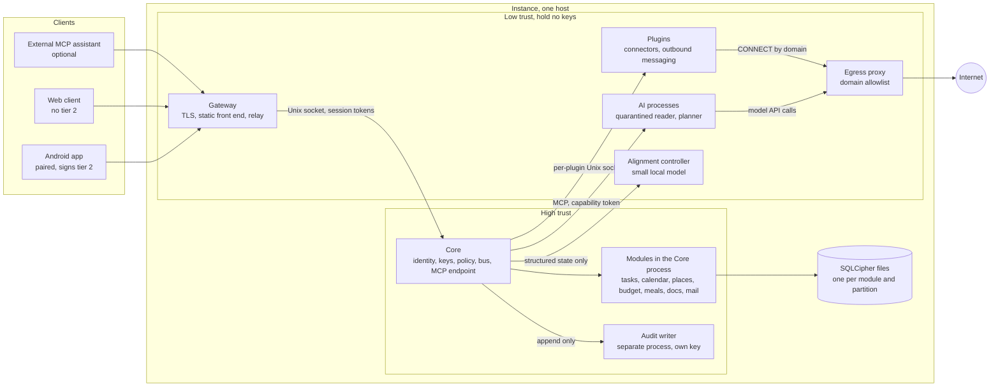
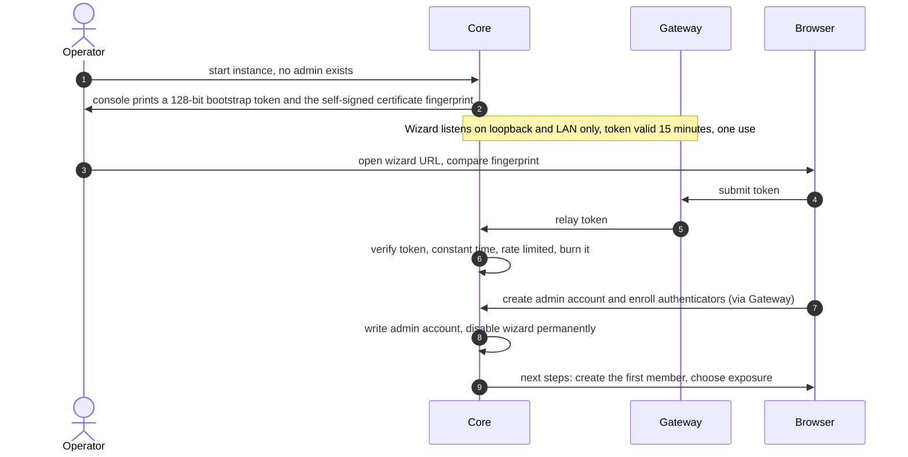
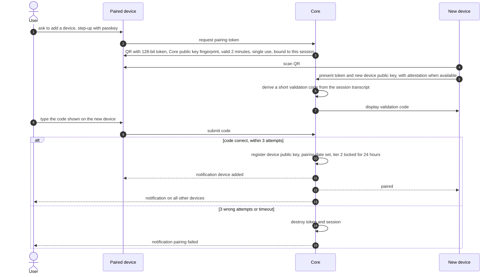
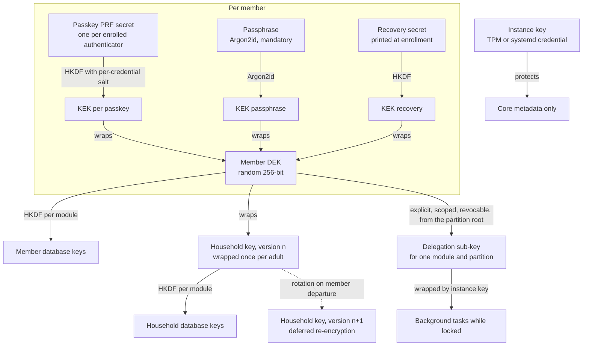
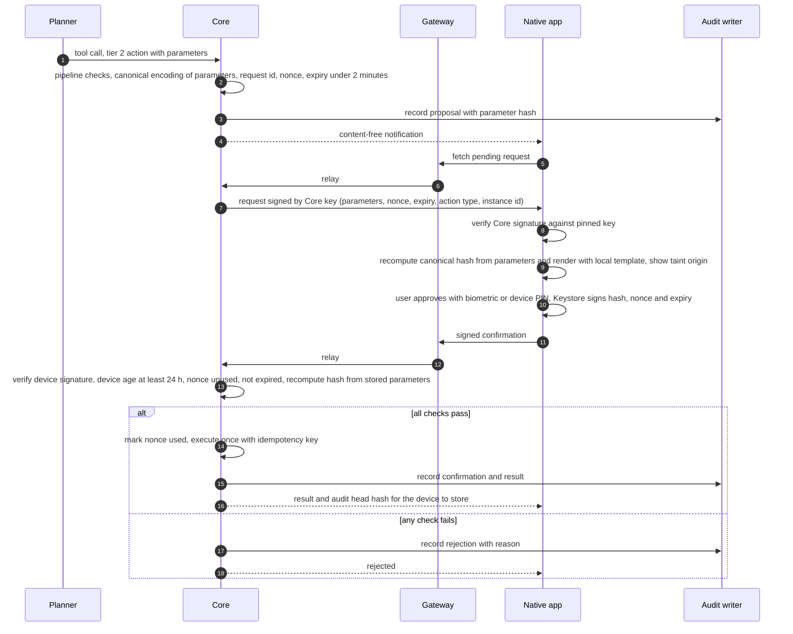

# Architecture

Status: design phase, no code yet. Revision 1. This is the central document: the other documents refer to it for component names and trust boundaries, and it refers to them for detail. Terms in **bold** at first use are defined in the [glossary](README.md#glossary).

Companion documents: [threat-model.md](threat-model.md) (who attacks what), [key-management.md](key-management.md) (keys, unlock, recovery, rotation), [ai-safety.md](ai-safety.md) (rules for the assistant), [capability-matrix.md](capability-matrix.md) (every action, its tier and confirmation), [decisions.md](decisions.md) (why), [research-notes.md](research-notes.md) (what is verified, assumed, or still to test).

## 1. Purpose and how to read this document

Vilicus is one self-hosted installation per household. It stores sensitive data, holds credentials for outside services, and lets an AI assistant act through typed tools. The architecture has one job: make sure that a wrong, fooled, or hostile component can only do a bounded amount of damage, and that the damage is visible afterwards.

Sections 3 to 8 describe structure and keys. Sections 9 to 11 describe how actions are authorized. Sections 12 to 16 describe modules, plugins, audit, transport and the supply chain. Section 17 lists failure behaviour, section 19 records the challenge passes this document went through, and section 20 lists the risks that remain open. Anything marked **open** is a decision not yet taken.

## 2. Design rules

1. **The Core decides.** Models, plugins, the Gateway and clients propose or relay; only the Core authorizes and executes.
2. **Keys live in one place.** Only the Core holds key material. Modules receive opened database handles scoped to a partition, never keys. Plugins and AI processes receive nothing secret except what a single task needs.
3. **No third-party code in the Core process.** Trusted modules are crates compiled into the binary. Everything else runs as a separate, sandboxed process behind a closed-type protocol.
4. **Trust labels travel with data.** Every record carries a taint label (section 5.4). Labels only get more restrictive as data is combined.
5. **Irreversible means a human, on a device that can show what is signed.** No chat reply, web click or message can authorize a tier 2 action.
6. **Fail closed, say so, stay usable.** When a control cannot decide, the action waits for a human; when a dependency is down, the behaviour is defined (section 17), not improvised.
7. **Claim what is built.** Properties that depend on the deployment (TLS termination, host trust, hardware support) are documented as conditions, not as guarantees.

## 3. Components and trust levels

| Component | What it is | Trust | Holds keys | Runs as |
|-----------|-----------|-------|-----------|---------|
| **Core** | Identity, authentication, key management, policy engine, capability tokens, event bus, module registry, migrations, MCP endpoint, plugin supervisor | Highest | Yes, the only one | Main process |
| **Modules** | Trusted crates (tasks, calendar, places, budget, meals, docs, mail help). Each owns its own databases and migrations | High (reviewed code, but same address space as the Core) | No, receive scoped handles | Inside the Core process |
| **Gateway** | Terminates TLS when no reverse proxy does, serves the embedded front end and the app API, relays pairing and confirmation traffic | Low: exposed to the network, assumed compromisable | No | Separate unprivileged process, same binary, own subcommand |
| **Audit writer** | Appends to the tamper-evident log | High, minimal | Its own HMAC key only | Separate process |
| **Plugins** | Third-party connectors (store connectors, outbound messaging, other integrations) | Untrusted | Only their own scoped secret | One sandboxed process each |
| **AI processes** | Quarantined reader, planner, optional drafter (see `ai-safety.md`) | Untrusted by design | No | Separate sandboxed processes |
| **Alignment controller** | Small local classifier used on structured state (section 11.4) | Untrusted output, bounded role | No | Separate sandboxed process, no network |
| **Egress proxy** | Domain-allowlist forwarding for plugins and AI processes; does not terminate TLS | Low | No | Separate process |
| **Clients** | Web, Android app, later a desktop app | Web: untrusted. Paired native app: trusted for confirmation only | Hold their own device key, never the data keys at rest | User devices |

"Single binary" means one executable with subcommands (`core`, `gateway`, `audit`, `egress`, and so on) started as separate systemd units. Separation is between processes, not between binaries, which keeps installation simple and keeps the isolation real.

Assumption stated early because the rest depends on it: modules are in the Core's address space. The "modules have no keys" rule is enforced by API shape and code review (`#![forbid(unsafe_code)]`, no key types exported to module crates), not by memory isolation. A malicious module is therefore a supply chain failure (section 16), not something the runtime contains.

## 4. Process model and deployment

- Supported in v1: Linux with systemd. Other platforms are out of scope for the server.
- The Core creates the Unix sockets for the Gateway, the audit writer, each plugin and each AI process, and verifies the peer with `SO_PEERCRED` on every accepted connection (user id and, where useful, process id and cgroup). A socket is never reachable by another service account.
- Every sandboxed service gets a fixed unit profile imposed by the Core's installer and checked in CI: `DynamicUser=yes`, `ProtectSystem=strict`, `ProtectHome=yes`, `PrivateTmp=yes`, `NoNewPrivileges=yes`, `SystemCallFilter=@system-service`, `RestrictAddressFamilies` limited to what the service needs (usually `AF_UNIX` only), `IPAddressDeny=any`, `MemoryMax` and `TasksMax` limits, `LoadCredential` for the single secret the service owns. A plugin cannot widen its own profile; changing it is a rights change (section 13).
- Outbound network access for plugins and AI processes goes through the egress proxy, which accepts `CONNECT host:port` only for domains on the allowlist the Core sends it. It does not terminate TLS, so it sees destination hostnames, not content. Domain filtering is finer than IP filtering because CDN addresses are shared, but it can be bypassed by domain fronting-style tricks on the same CDN; the allowlist should therefore list exact hostnames, not wildcards.
- Memory hygiene in the Core: no core dumps (`PR_SET_DUMPABLE` off, `LimitCORE=0`), key buffers in locked memory (`mlock`) and zeroized on drop, swap disabled or encrypted. These reduce, not remove, the exposure of unlocked keys to a root attacker (see section 20, R1).
- The Core holds an **instance key** (not a data key) delivered through a systemd credential, sealed to a TPM when available, so that the instance can start unattended, open its own database and serve the login page. It protects instance metadata only (section 5.2). It can never decrypt member or household data.

## 5. Data model and storage

### 5.1 Databases

- SQLite with SQLCipher (AES-256). Keys are 256-bit raw keys derived by the application (SQLCipher does not implement Argon2), so the passphrase work factor is under Vilicus control and the SQLCipher internal KDF is bypassed with a raw key.
- **One database file per module and per partition**, plus Core files. A **partition** is either a member's personal partition or the household partition. The module code is one crate; at runtime a module opens `tasks.household.db`, `tasks.<member-id>.db` and so on. This is how "partitions are isolated by keys" and "each module has its own database" hold together: a file has exactly one key, and a key belongs to exactly one partition. (This refines the earlier one-file-per-module wording; see D3 in `decisions.md`.)
- `secure_delete` is on. WAL files and journals live next to the database and are covered by the same encryption.
- Where deletion must be real (mail cache, attachments, assistant memory, documents), sensitive records are additionally encrypted with a per-record key stored wrapped in the same database, and deletion destroys that key (**crypto-shredding**). Limits: copies of the database in older backups still contain the wrapped record key (section 18), and shredding is only applied to the record classes that need it, because per-record encryption costs search and indexing ability.
- Audit entries never contain sensitive parameters in clear: they hold identifiers, canonical parameter hashes, tier, actor and outcome (section 14).
- PostgreSQL was rejected: it is an external service, offers no native transparent encryption, and a household's volume is tiny (D2).

### 5.2 Core files

| File | Content | Protected by |
|------|---------|--------------|
| `wrappers.db` | Wrapped key blobs (never raw keys), wrapper headers, per-member public keys, KDF parameters | Not encrypted by the instance key: every blob is already ciphertext under a member secret, and integrity is protected by an HMAC. Kept separate so that losing the instance key never loses the ability to unlock data |
| `core.db` | Accounts, roles, authenticators (public keys), devices (public keys, attestation), nonce ledger, plugin registry and manifests, policy, capability token metadata, migration registry, sealed delegation sub-keys | Instance key. Metadata only |
| `core.<partition>.db` | Cross-module link table, provenance index, confirmation queue for that partition | The partition key |
| `audit.db` | Hash-chained log | Written by the audit process; integrity by HMAC chain and external anchors |

Losing the instance key (TPM change, disk moved to another host, restore onto a new machine) costs the metadata in `core.db` and any delegation sub-keys, not the data: members unlock from `wrappers.db` with their own secrets and the admin rebuilds `core.db`. An **admin recovery code** printed at bootstrap lets a new admin credential be created on an existing data directory without wiping it; it grants no data access. Honest consequence: someone who steals the disk and also gets the instance key (for example a copied disk without a TPM) learns metadata such as member names, device names and the shape of the registry, but no data and no usable keys, because the wrapped keys are still protected by member secrets.

### 5.3 Cross-module consistency

There are no transactions across databases. Modules react to one another through events and the **outbox** pattern: a change is committed in the module's own database together with a row in that database's outbox table (one transaction, one file); the Core delivers the event at least once once the partition is unlocked, so delivery after a restart waits for an unlock or a delegation; consumers are idempotent. A module cannot write into another partition on an event. Where one fact must appear in two partitions (a recipe reminder for a household meal plan), the Core stores it once in the partition that owns it (the household calendar) and presents a merged view at read time. Cross-module references are opaque identifiers registered in the Core's link table, which lives in the partition of the data it links. A link never crosses partitions: a household meal plan entry and a personal calendar event are joined by two links, each in its own partition, created through an explicit tier 2 action when the write crosses the boundary (section 9.4).

### 5.4 Provenance (taint) is part of every record

Every record of every module has two mandatory metadata fields, enforced by the storage layer (a table without them cannot be registered by the module registry):

- `source`: who produced it (a member, the system, a module, a plugin id, a mail account, an AI task).
- `taint`: `trusted` or `external`.

Rules:

1. Records typed by a member, or computed by Core and modules from `trusted` inputs, are `trusted`.
2. Anything that came through a plugin, a mail, a web page, a file import, a calendar invitation or a model, is `external`.
3. Derived data inherits the most restrictive label of its inputs. A summary of external data is external.
4. At read time the Core computes an **effective taint for the viewer**: a `trusted` record authored by another member is delivered to a member's assistant as `member`. The order is `trusted` < `member` < `external`. An assistant treats `member` data as untrusted instructions-wise (it can read it as data, it never follows it).
5. A record written by a tainted session inherits that session's taint. Copying or importing external text into a trusted field is a promotion and is tier 2, with the source shown.
6. Promoting a record to a lower taint is a tier 2 action. Free text of `member` taint (a household record written by another adult) is routed through the reader like external text before a planner uses it. Writing from a personal partition into the household partition or into another member's partition is also tier 2.

The label is metadata, not a filter: the point is that every consumer (policy engine, confirmation screen, memory, audit) can ask for it without trusting the producer.

## 6. Identity, roles, sessions and devices

- Roles: **member** (owns a personal partition, belongs to the household partition) and **instance admin** (manages the system). One human can hold both roles, with two distinct login contexts. The admin role grants no access to any data key (section 8, `key-management.md`). Adults and children are both members; children's accounts can be flagged as managed, which restricts which actions their assistant may take.
- Authentication: passkeys (WebAuthn) by default. TOTP exists only as a fallback second factor for login on a device without passkey support; it is never accepted for tier 2 confirmation, pairing, recovery or admin step-up.
- **Step-up**: a fresh passkey assertion, required for human-only actions (the "H" actions of the capability matrix).
- Sessions are bound to the device key of a paired device where one exists, so a stolen cookie alone is not enough. Web session: `__Host-` cookie, `HttpOnly`, `Secure`, `SameSite=Strict`, 15 minutes, no "remember me", revocation checked by the Core on every request (not only by the Gateway), no secret in `localStorage`.
- Content security policy: `default-src 'none'`, `script-src 'self'` with nonce, `frame-ancestors 'none'`, `base-uri 'none'`, Trusted Types enforced. External content (mail bodies, imported pages, recipes) is rendered inside a sandboxed iframe served from a separate origin, without scripts.
- The web client is a paired device with a session. It can read and write within a member's rights, but it never confirms a tier 2 action, and an unmanaged browser (no pairing) gets login-free pages only.
- A **paired device** is a client with a registered public key and a pairing date. A new device cannot do tier 2 or pair other devices for 24 hours.

## 7. Bootstrap and pairing

### 7.1 First start

Rules:

- Token: 128 random bits, printed only on the console and in the service journal of the Core, usable once, expiring after 15 minutes. If it expires, restart the Core to get a new one. Failed submissions are rate limited and counted.
- Until bootstrap completes the wizard listens on loopback and private LAN addresses only, over TLS with a self-signed certificate whose fingerprint is printed with the token so the operator can detect an interception.
- The wizard session is a bootstrap session, not a paired device; devices are paired afterwards (section 7.2). The admin account is created once. After that the wizard code path is disabled. It can only come back on a clean data directory; to regain admin control of an existing one, use the admin recovery code printed at bootstrap (section 5.2).
- The admin step does not create data keys. Creating a member is a separate flow in which the member's own authenticators and recovery material are generated (`key-management.md`, section 3). The wizard offers to create the first member in the same session when admin and member are the same person.
- Public exposure is a later, explicit setting with a blocking warning (section 15).

### 7.2 Pairing a device

Properties and limits:

- The token alone is useless: without the matching session on the already-paired device, and the code typed there, the pairing does not complete. The code is derived from the key exchange transcript (a short authentication string), so a relay that sits between the two devices produces two different codes and fails the comparison.
- The native app learns the Core's public key fingerprint from the QR and pins it. This is what lets the app authenticate confirmation requests (section 10) even if the Gateway and the TLS terminator are not trusted.
- The new device generates its own signing key in hardware (Android Keystore, StrongBox when present) and registers only the public key; key attestation data is stored for later review.
- A new device has a 24-hour delay before it can sign tier 2 confirmations or pair further devices. All devices are notified at once.
- The first device of a fresh install is treated like any other, delay included. There is nothing to confirm on day one, and an exception would be an attack path.
- A web "device" is paired in the same way for the session and passkey binding, but its key is not hardware attested and it is never accepted for tier 2.

## 8. Keys and unlocking (summary)

Full detail, including recovery and rotation, is in [key-management.md](key-management.md). The structure:

Summary of the guarantees and of their limits:

- Each member has a random data key (DEK) wrapped by several independent key-encryption keys (KEKs): one per enrolled passkey (when the authenticator supports the WebAuthn PRF extension), one from a mandatory passphrase, one from an offline recovery secret. Losing one factor loses nothing as long as another remains.
- The PRF secret is evaluated on the client and sent to the Core over TLS, which uses it to unwrap the DEK and keeps the DEK in memory for the session. **This is not zero-knowledge**: the Core and anything with access to its memory sees the key, and a compromised Gateway or TLS terminator sees the PRF output in transit for web clients (R3).
- The instance admin is separate from data keys. There is no admin reset that re-wraps a member's key. If a member loses every authenticator and the recovery secret, that member's personal partition is lost. This is assumed and documented.
- The household partition uses a versioned household key. On the departure of a member the key is rotated and data is re-encrypted in the background (deferred, with visible progress); it protects data written after the departure, and the departed member keeps whatever they already had.
- Any recovery starts a waiting period and alerts every device.
- Background tasks act only for members currently unlocked, or through an explicit delegation sub-key (`key-management.md`, section 7).

### 8.1 Locked instance and notifications

After a restart every member is locked. A background task whose member is locked waits for an unlock, up to a maximum duration (default to tune, proposal 12 hours), then is cancelled and the cancellation is recorded. When the unlock arrives the Core issues a fresh capability token to the waiting task, carrying over its persisted taint state. The member is told through a **content-free notification**: the app and the web client show only "something needs you" with no title, no sender, no amount. Delivery uses a persistent connection while the app is running, or UnifiedPush, rather than Google's push service; web clients get it while the page is open (an optional Web Push is possible, with the caveat that the browser vendor's push service then sees metadata and timing).

## 9. Action pipeline and tiers

### 9.1 Tiers and confirmations

| Tier | Meaning | Confirmation |
|------|---------|--------------|
| 0 | Read | None |
| 1 | Reversible write: reversible **without effect on a third party** | None; journaled and undoable. **Elevated** when the session is tainted (section 9.3) |
| 2 | Irreversible, or any effect on a third party, or crossing a partition boundary | **Signed confirmation** from a paired native app (section 10), every time |
| H | Human-only administrative action (pairing, rights changes, recovery, exposure, plugin install) | Step-up with a passkey, or signed confirmation if the action affects other people; never exposed through MCP |

"Reversible" never includes an outbound network effect. These are tier 2: accepting or declining an invitation (RSVP), moving or editing an event that has guests, synchronizing to an external account, sharing outside the instance, sending anything. The only outbound effect that is not tier 2 is a **system notification**: a static template, sent to the member's own pre-registered channel, containing no free text and no URL derived from a model, rate limited (section 13.4).

Confirmation kinds, used consistently in all documents: **none**, **light confirmation** (one explicit tap in an authenticated paired session, the web client is allowed), **signed confirmation** (native app, section 10), **step-up** (fresh passkey assertion).

### 9.2 Pipeline

Every tool call from an AI process or an external MCP assistant goes through the same ordered steps in the Core. A step that fails ends the call.

1. **Schema validation.** Strict types, `deny_unknown_fields`, no repair of invalid calls.
2. **Capability token.** The call must fall inside the token's task, module, partition, action set and budget. Tokens are short-lived (minutes), bound to one task and one member, revocable.
3. **Deterministic rules.** Allowlists (recipients, domains), caps (section 9.5), tier lookup in the matrix, idempotency check.
4. **Taint evaluation.** Session taint and parameter taint decide whether the call is plain, elevated, routed to the tainted queue, or denied.
5. **Alignment controller**, only for elevated tier 1 calls (section 11.4). It can approve or pass to a human; it cannot veto a deterministic rule and cannot touch tier 2 or H.
6. **Human**, when the table says so: light confirmation for elevated tier 1 when the controller did not approve; signed confirmation for tier 2; step-up for H.
7. **Execution** inside the module, with an idempotency key derived deterministically from the business parameters (for example order cart hash and slot, event id and new start time), so a retry or a duplicate proposal does nothing twice.
8. **Audit** write, acknowledged before a tier 2 result is reported as done (section 17).

### 9.3 Session taint

An AI **session** is one task with one capability token. The token is tainted the moment the session consumes any `external` or `member` datum, including the typed output of a quarantined reader, because the choice of an enum value can still be influenced by the content. Effects of a tainted session:

- tier 0: allowed;
- tier 1: elevated (controller, else light confirmation), with exceptions listed in the matrix for low-risk record kinds;
- tier 2: the request goes to a **separate tainted queue** with a visible origin, with stricter limits (section 10.3);
- H: denied, always;
- the kill switch: cannot be triggered by a tainted session (section 9.6).

This makes taint creep a real usability cost: after reading mail, the planner's writes are elevated. That cost is accepted; the controller and bounded-output marking (section 11.3) are the relief, and the rate of friction is a metric to watch (R7).

### 9.4 Partition boundaries

Reading follows the caller's partition scope: a member's assistant can read that member's partition and the household partition, never another member's. Writing from a personal partition into the household partition, or into another member's partition, is tier 2. A datum written by another member is `member` taint for the receiving member's assistant. Household-partition writes that originate in the household partition itself (for example an adult editing the shared shopping list) are ordinary tier 1.

### 9.5 Caps, digest and limits

- Default caps (to tune in testing) live in the capability matrix, section 11: orders per week, messages per hour, tool calls per task, token and cost budget per task and per member per day.
- A **daily digest** lists everything the assistant wrote in the last day, rendered from the module journals; a human is expected to read it, and the unread-digest count is itself surfaced.
- The Core injects the current date and time zone into every task context. The model never infers them.
- A pinned model version per role; switching versions runs the evaluation suite first (section 11.5).
- If the AI provider is unavailable the task is queued with a timeout, then fails with a notification; there is no silent fallback to a different provider with different data policy.

### 9.6 Kill switch

The kill switch revokes all outstanding capability tokens, suspends the AI processes and stops queued tasks. It can be triggered by the human (any authenticated session) or by Core detectors (cap breach, loop detection, repeated denials). It cannot be triggered by a tainted session, because an attacker could use it as a denial of service. Resuming requires a passkey step-up.

## 10. Tier 2 confirmation

### 10.1 What the device does

- The app receives parameters from the Core (through the relaying Gateway), **verifies the Core's signature** on the request, computes the canonical hash of the parameters itself (deterministic CBOR, RFC 8949 section 4.2.1), **displays** them with a locally shipped template per action type, and signs with a hardware-backed key that requires biometric or device credential for each use.
- Unknown action types or template versions cannot be confirmed: the app shows "update required" and fails closed.
- The signed payload binds: instance id, member id, device id, action type and version, canonical hash, nonce, expiry (at most 2 minutes, default 90 seconds; if it lapses before the user acts, the unchanged proposal can be re-issued with a new nonce).
- Optional reinforcement for the most sensitive action types: **Android Protected Confirmation** (`ConfirmationPrompt`), when `isSupported()` returns true on that device at runtime. It binds a short human-readable text to a signature produced in the trusted execution environment. Hardware support is uneven, so it can never be the only path (R9). Secure Payment Confirmation is a purely opportunistic bonus for browsers that support it (Chrome, Edge) and does not replace the native path. WebAuthn transaction-authorization extensions are abandoned and not used.

### 10.2 What the Core does

The Core never trusts the relay. It recomputes the canonical hash from the parameters it stored when the request was created, compares with the signed hash, verifies the device signature against the registered key, and checks nonce, expiry, device age, member binding and queue rules. Every reference in the parameters (a draft, a cart, a sync batch) is resolved into an **immutable, content-addressed snapshot** before the request is issued, so the signed hash covers the content and not just an identifier. At execution time the Core re-verifies any external state it depends on (cart items and total, delivery slot, recipients) against the snapshot and aborts on mismatch. A Gateway that swaps the parameters shown to the user produces a signature over a different hash and is rejected; a Gateway that forges a request cannot, because the app checks the Core's signature.

### 10.3 Queue and anti-fatigue rules

- One pending signed request at a time by default; batching groups homogeneous requests (for example the same cart) into one decision with each line item shown.
- Requests from tainted sessions go to a separate queue, labelled with the origin, with a lower pending limit.
- Repeated refusals (default 3 in a row on the same task) suspend the task and notify the member.
- Confirmations must stay rare and legible; the rate of tier 2 requests per week is monitored and reported.

### 10.4 What this does not give

- Desktop clients: a paired native desktop app with a key in the TPM or Secure Enclave gives intermediate assurance (no trusted display); documented as such. The web client never does tier 2, because WebAuthn does not prove what was displayed and the Gateway is not trusted.
- A phone with malware that controls the screen defeats the display guarantee unless Protected Confirmation is in use (R9).
- A user who approves without reading defeats the system; the design reduces the number of prompts, it cannot make people attentive.

## 11. The AI runtime

### 11.1 Roles

- **Quarantined reader**: reads untrusted content (a mail, a page, a file). It has no tool that writes, sends or pays, **no network access at all**, and sees no private data beyond the object it reads. Web lookups are a separate Core stage whose query is built from a Core-chosen template or enum, never from reader-produced text. Its output is closed enums, bounded numbers and **opaque identifiers resolved by the Core**, never a free string forwarded to the planner. Output is validated by the Core and marked `external` (with a "bounded" flag).
- **Planner**: the privileged role with the tools. It never sees raw untrusted text. It works on reader output and trusted data.
- **Drafter** (optional role): reads untrusted text in order to write a reply. It has no send ability. Its output is a free-text **draft object**, `external`, stored locally, shown only to the human, never fed back to the planner as text. Sending the draft is tier 2 with the full text displayed.
- **Notification output** comes from static templates with parameters resolved by the Core, never from model text.

An external MCP assistant (for example a personal assistant connecting from outside) is treated as a planner whose host Vilicus does not control: it uses the same token, pipeline and taint rules. Because Vilicus cannot split its reader and planner, raw bodies of untrusted content are not returned by default to external assistants; they receive the reader's typed output, and a raw read is a per-member opt-in with the session tainted from that moment. Because that host is outside the egress proxy, every tier 0 read it makes already leaves the instance: external assistants get a per-record-kind read allowlist (default: nothing sensitive, no budget, no raw mail), per-session volume limits, taint accounting like any session, and audit of reads.

### 11.2 Memory

The `MemoryStore` interface covers episodes, entities, dated facts with validity start and end, provenance, invalidation instead of deletion, quarantine of facts of untrusted origin, and rollback. The default backend is native Rust over encrypted SQLite (full-text and vector search), one store per partition, inside that partition's key. The Graphiti backend (Python, Apache-2.0, needs a graph server) is an optional annex component: enabling it moves memory content outside the SQLCipher boundary into the graph server's storage, so it is off by default, opt-in per partition, and documented as a reduction of at-rest guarantees. Long-term memory is Markdown documents with frontmatter stored in the partition database; a Markdown export is available.

### 11.3 Bounded outputs and taint creep

The reader's output types are chosen to carry few bits (enums with small cardinality, ranges, ids). A bounded-output flag lets the policy engine treat a tainted session that consumed only bounded outputs as a lower friction class for tier 1 writes in low-risk record kinds. The flag never relaxes tier 2.

### 11.4 Alignment controller

A small local model (CPU only, under 16 GB of RAM) that answers one constrained question for a proposed elevated tier 1 action: accept, or ask a human, with a probability and a confidence score. Position in the pipeline: after the deterministic rules, before the human.

Hard constraints:

- Input is **structured state only**: the user's original request (as recorded by the Core from a trusted channel), the action type, enums, identifiers and diff metadata, and provenance flags. It never receives free-text fields (titles, notes, bodies, place names), and a deterministic rule keeps tainted-origin values out of its input. For a task with no trusted original request (a background task) its answer is advisory only and the human decides.
- Output is a choice from a closed set, constrained by grammar. Any doubt, error, timeout or unavailability means "ask the human" (fail closed).
- It never replaces human confirmation of an irreversible, financial or third-party-affecting action. It cannot see or alter its own thresholds, which are set by a human.
- It is evaluated on a household-specific set of legitimate and trapped cases; the primary metric is the **false accept rate**, then false reject rate and calibration error (ECE).

Planned v1 realization: a 3 to 4 billion parameter model in GGUF Q4 (Qwen or Gemma families), grammar-constrained output (GBNF), and reading the log-probabilities of the options, with probability recalibration on the household evaluation set and conservative thresholds. A v2 option is a fine-tuned encoder classifier. The commercial Jev model by TypeSafe AI (Choice, Score, Noul primitives) is a conceptual reference only: it is proprietary, API only, English first and not self-hostable, so it is not a dependency; at most an optional connector for non-sensitive data. Language quality in French and CPU latency are untested (`research-notes.md`).

### 11.5 Operating rules

Pinned model versions; an evaluation suite (injection corpus, controller cases, tool-call correctness) runs before any version switch and in CI; per-member token and cost budget; loop and repetition detection; dry-run mode that returns what would be done.

## 12. Modules, event bus and migrations

- A module is a crate exposing: its schema (declarative SQL), its record types with taint, its tool definitions (name, schema, tier, rows of the capability matrix), its event topics, and its journal and undo handlers. `#![forbid(unsafe_code)]` is mandatory.
- **Event bus** (in the Core): the Core stamps the emitter; a message cannot claim another emitter. Each topic has an ACL for publishers and subscribers. Events originating in plugins are always marked `external`. No tier 2 transition is ever triggered by an event: events can create proposals and notifications, never confirmed actions.
- **Migrations**: declarative SQL embedded in the binary; each migration's hash is frozen and signed in the registry. A dedicated connection applies migrations with an SQLite authorizer that refuses `ATTACH`, `DETACH` and any `PRAGMA` outside a short allowlist; extension loading is disabled for every connection. Migrations only go forward. Migrations run per module and per partition, at the moment that partition is first unlocked after an installation (or through a delegation), so schema versions may differ between partitions until every member has unlocked; the Core tracks the version per file. A cold file copy of the database (no key needed) is taken automatically before each migration. The Core refuses to open a module database that is newer than the module's code (no silent downgrade).
- Modules never read each other's tables. Cross-module reads go through typed public APIs registered with the Core; the Core checks the caller's partition scope on each call.

## 13. Plugins and connectors

### 13.1 Isolation and protocol

Each plugin is a separate process under the profile of section 4 with one Unix socket created by the Core, peer-verified. The protocol is JSON-RPC or CBOR with closed types (`deny_unknown_fields`), bounded frame sizes and per-call timeouts (the format is **open**, D19). The response schema requires a `taint` field; the Core overrides anything claiming to be `trusted`. Plugins cannot write audit entries, publish events outside their topics, or open files outside their own state directory.

### 13.2 Manifest and rights

A plugin ships a signed manifest bound to the hash of its binary: operations, tier of each write operation, requested network domains, the one secret it holds. Installing a plugin, granting network domains, changing an AI provider's data policy and every change of rights are human-only and require the Core to display the diff and a passkey step-up. Because these actions widen what can reach or leave the household's data, they also start a **delay** (proposal: 24 hours) with a notification to every adult member, and any adult can veto during the delay. Releases are verified against the project's offline signing key, which the admin does not hold. Revocation uses a signed revocation list; a revoked plugin is stopped and its secret deleted. WASM isolation (WASI 0.3) is envisaged for v2 behind the same interface.

### 13.3 Connectors

- **Mail and calendar, v1**: IMAP and SMTP with an application password, and CalDAV, against providers such as Fastmail, iCloud, OVH, Gandi, Nextcloud, generic servers and personal Gmail with two-factor and app password. Gmail and Outlook through OAuth only in "bring your own client" mode (each household creates its own project), read-only by default, writes enabled per account and per action. A shared, verified Google or Microsoft application is not realistic (Google requires a yearly security assessment for restricted Gmail scopes). Work accounts under corporate policy are often blocked and must be treated as best effort. Refresh tokens are secrets encrypted with the member's key.
- **Groceries**: Vilicus generates the shopping list; a plugin prepares a cart inside the user's own session of the store; a human validates before any order. First step is semi-manual. No catalog or price data is shared between households. No anti-bot circumvention. An official API is preferred whenever one exists.
- **Messaging (Telegram, Signal, WhatsApp)**: outbound only, for notifications that carry no sensitive content. An inbound message is untrusted content that triggers no action. No tier 2 confirmation ever travels through a plugin.

### 13.4 Notifications

System notifications are static templates with a closed parameter set resolved by the Core, sent to the member's own registered channel, rate limited, and logged. Because template choice and timing are a covert channel with low bandwidth, the rate limit is part of the design and not an option.

## 14. Audit

- An append-only hash chain with HMAC (each entry covers the previous hash), written by a separate process with its own key. The Core and modules can only append through its socket; plugins cannot.
- Each entry holds: time, actor (member and assistant), task, capability token id, action, tier, opaque identifiers, canonical parameter hash, taint, outcome. No sensitive parameter in clear.
- At every tier 2 event the head hash is **anchored off the machine**: the signed confirmation response returns it to the confirming device, which stores it; an optional remote sink (for example a syslog target) can receive it as well. A verifier recomputes the chain, checks it against the anchors, and finds the earliest broken entry.
- Limits: the audit process protects against tampering by the Core's other components and by plugins, not against root on the host (R1); anchors bound how far back a root attacker can rewrite undetected.

## 15. Transport, exposure and clients

- Default listening: private interfaces only. Internet exposure is a deliberate setting with a blocking warning, and the documentation recommends a VPN or an existing reverse proxy instead.
- TLS 1.3. The server prefers the hybrid key exchange X25519MLKEM768 (rustls with aws-lc-rs and its `prefer-post-quantum` option) when the client offers it, tested by real handshake on every supported client. Honest wording: the transport uses the hybrid exchange when both the client and the TLS terminator support it. Certificate signatures, WebAuthn and device signatures remain classical. A third-party reverse proxy that terminates TLS removes the end-to-end benefit. At rest, AES-256 with keys derived by Argon2id. No post-quantum signatures in v1 (no public CA issues them, WebAuthn support is in drafts), and no additional application-layer encryption for that purpose. Algorithm identifiers are versioned in every wrapped key and protocol message, so primitives can be rotated.
- Clients: one responsive front end with three wrappers. **Web**: comfort on wide screens for budget, tasks and calendar, paired device, short sessions, no tier 2. **Android app**: native shell, empty until paired, hardware key, QR scanning, notifications, tier 2 confirmation. **Desktop**: later, Tauri, with the intermediate assurance noted in section 10.4. The front-end framework is **open** (D26).

## 16. Supply chain and releases

`cargo deny` and `cargo vet` in CI; vendored dependencies and `--locked` builds; an allowlist for crates with `build.rs` or procedural macros, each audited; `#![forbid(unsafe_code)]` in modules; minimal dependencies in the Core. Goal: reproducible builds checked by two independent builders. Releases are signed with an offline key, include an SBOM, and carry a monotonic version number; the Core refuses an older signed release than the highest it has seen (anti-rollback). The Core never updates itself; the admin installs a release, with a passkey step-up and a displayed version diff.

## 17. Failure behaviour

| Situation | Behaviour |
|-----------|-----------|
| Core crashes during an action | The module commit and the outbox row are atomic; on restart the outbox is replayed; idempotency keys make external effects safe to retry. An external effect with unknown outcome is reported to the member, not retried blindly |
| Instance restarted | All members locked; tasks wait for unlock up to the maximum duration, then are cancelled and recorded; content-free notification sent |
| Audit writer unavailable | Tier 2 and administrative H actions are refused (no execution without an acknowledged audit entry). A small emergency set (unlock, lock, device removal, recovery cancel, kill switch) proceeds and is written to a sealed local spool that is replayed into the chain when the writer returns. Tier 0 and 1 continue with a bounded buffer persisted to the same spool; when it fills, the assistant is suspended |
| AI provider unavailable | Task queued with timeout, then failed with a notification; no silent provider switch |
| Alignment controller unavailable or uncertain | Treated as "ask the human" |
| Plugin crashes or hangs | Call times out, plugin restarted with backoff, repeated crashes disable it and notify the admin; its taint-marked outputs are untouched |
| Database newer than module code | Module not started, admin alerted, no automatic repair |
| Host clock wrong or jumps | Expiries and rate limits use the Core's monotonic clock; large wall-clock jumps suspend tier 2 until a human acknowledges |
| Disk full | Writes fail closed; audit has a reserved space so denials can still be logged |
| Backup restored | Nonce table and audit anchors are rolled back with it; the Core compares against device-held anchors and refuses tier 2 until a human acknowledges the discrepancy |
| Lost device | Removal revokes the device key and its sessions; if it held the only enrolled authenticator, use passphrase or recovery |
| Store site changes or blocks the connector | Plugin fails visibly; nothing else is affected; manual shopping list still works |

## 18. Backups

- Backups are cold or snapshot file copies of the already-encrypted files (plus `wrappers.db` and `core.db`), so they need no key and the admin, who holds none, can run them. A manifest records each file's generation and hash. Copies are consistent per file, not across files; after a restore the Core reconciles through the outbox and the link table, and reports orphaned links.
- Backups contain wrapped keys but never raw keys; restoring requires member secrets, so a stolen backup is as protected as a stolen disk.
- A backup contains old wrapped record keys, so crypto-shredding does not apply to existing backups; backup retention is therefore a privacy setting, shown as such.
- Restoring an older state rolls back the nonce ledger in `core.db` and the audit chain together with it, reopening used nonces; section 17 describes the guard.

## 19. Challenge passes

This document was attacked twice by its author, then reviewed independently. Findings that changed the design are listed so the reasoning is auditable.

### 19.1 Pass 1: failures and coherence

| # | Finding | Change |
|---|---------|--------|
| F1 | "One file per module" and "partitions isolated by keys" contradict: one file cannot have two keys | One database per module and per partition (section 5.1, D3) |
| F2 | The Core must open its database to show a login page, but all keys are locked after restart | Instance key (section 4) protecting metadata only; data stays locked |
| F3 | Background tasks vs. locked instance: no way to act | Delegation sub-keys and the wait-then-cancel rule (sections 8, 8.1) |
| F4 | The cross-module link table would leak links across partitions | Link table lives in the partition of the linked data; a cross-partition link is a tier 2 action |
| F5 | "Elevate" meant "next tier" in the drafts, which made every tainted write a signed confirmation | Redefined: elevated tier 1 is controller or light confirmation; tier 2 is separate (section 9) |
| F6 | The audit writer being down would either block everything or leave gaps | Split behaviour: tier 2 and H refuse, tier 0 and 1 buffer then suspend |
| F7 | Pairing the second device needed a signed confirmation, but the first native device is 24 hours old | Pairing is an H action using step-up and code entry, not a tier 2 signed confirmation |
| F8 | Restoring a backup reopens used nonces | Anchors on devices and an acknowledgement rule (section 17) |
| F9 | Event bus could trigger actions through plugin events | Events never cause tier 2 transitions; plugin events are `external` |
| F10 | Drafting a reply requires reading raw untrusted text but the planner must never see it | Separate drafter role with local, human-only output (section 11.1) |
| F11 | Notifications are an outbound effect that contradicted "reversible has no third-party effect" | System notification defined as the sole exception, with templates and rate limit |

### 19.2 Pass 2: security and adversary

| # | Finding | Change |
|---|---------|--------|
| S1 | A Gateway could forge confirmation requests to spam the user | Requests signed by the Core, verified in the app against the pinned key |
| S2 | A Gateway could show a different parameter set | Device recomputes and displays the hash; the Core recomputes and compares |
| S3 | Kill switch as denial of service by an injected session | Not triggerable by tainted sessions; resume needs a passkey |
| S4 | Taint of reader output: enums can be steered | Session taint is set by consuming any reader output; bounded flag only relaxes low-risk tier 1 |
| S5 | A malicious admin could add a member to the household partition to read it | Household access needs an unlocked adult's signed approval; admin cannot wrap keys |
| S6 | Delegation sub-keys are stored under the instance key and weaken at-rest protection | Documented trade-off, explicit creation, scoped to one module, revoked with a rekey (`key-management.md`) |
| S7 | Egress proxy allowlist bypass through shared CDN hosts | Exact hostnames only, no wildcards, plugin manifests list them |
| S8 | Notifications as covert exfiltration channel | Static templates, resolved parameters, rate limits |
| S9 | Argon2id work done before authentication enables denial of service | Passkey or session authentication first; passphrase work only after a first factor or with a global concurrency limit |
| S10 | PRF output passes through the Gateway for web clients | Stated as a limit (R3); native app uses the pinned Core key for an inner channel (to specify) |
| S11 | Audit anchors depend on the device; a lost device loses the anchor | Several devices hold anchors and the optional remote sink |
| S12 | Dependency on a single model for the controller could be trained around | Thresholds not editable by the model or the assistant; tier 2 never delegated; false accept rate is a release gate |
| S13 | A compromised Gateway can forge a light confirmation (a web tap) for an elevated tier 1 write | Light confirmation is only enough for tier 1, which has no third-party effect and is journaled and undoable; anything with outbound effect needs a signed confirmation (R16) |
| S14 | An admin installs a plugin that then receives household data through legitimate tools | Plugin install and network rights are H actions with a displayed manifest diff; a plugin only receives what a tool call hands it, labelled by taint, behind the egress allowlist (R17) |

### 19.3 Independent reviews

Two read-only reviews (one on failures and coherence, one adversarial) were run on revision 1. Their findings that changed the design:

| # | Finding | Change |
|---|---------|--------|
| I-1 | Losing the instance key would also lose the wrapped keys held in `core.db` | Wrappers moved to `wrappers.db`; admin recovery code (section 5.2) |
| I-2 | The outbox could not be atomic with the module commit, and was unreachable while locked | Outbox table in each module database; delivery deferred to unlock (section 5.3) |
| I-3 | Cross-partition writes by events contradicted the tier 2 rule | Facts stored once in the owning partition, merged view at read time |
| I-4 | A locked adult's household wrapper could not be created | HPKE public-key wrappers (`key-management.md`, sections 2 and 5) |
| I-5 | Migrations and backups ignored locked partitions | Per-partition migration at unlock; cold file backups (sections 12, 18) |
| I-6 | Audit-down rule blocked unlock and recovery | Emergency action set with a sealed spool (section 17) |
| I-7 | The reader had private data plus web access | Reader has no network; lookups are a Core stage with templated queries |
| I-8 | Tainted writes could launder taint; member free text reached the planner raw | Writes inherit session taint; member free text goes through the reader (section 5.4) |
| I-9 | Signed hashes covered identifiers, not content | Content-addressed snapshots and execution-time re-verification (section 10.2) |
| I-10 | Untrusted free text could reach the controller | Controller input restricted to enums, ids and metadata; advisory only without a trusted request (section 11.4) |
| I-11 | The admin could widen data exposure alone; hostile adult could enrol or expel | Delay plus adult veto for plugin, provider and rights changes; unanimous adult approval with delay for adding or removing an adult |
| I-12 | Alerts could be muted by a compromised Gateway | Device acknowledgements, extended waiting period, signed heartbeat, session binding to device keys |
| I-13 | Delegation sub-keys weaken at-rest protection | Sealed inbox preferred for ingest tasks; TPM PCR binding recommended |
| I-14 | External MCP assistants bypass the egress proxy | Per-record-kind read allowlist, volume limits, audit |
| I-15 | Several invariants were untestable as written | Rewritten with mechanisms and thresholds (`ai-safety.md`, section 3) |

## 20. Remaining risks

| ID | Risk | Status |
|----|------|--------|
| R1 | Root on a running, unlocked host reads keys from memory and rewrites the audit log back to the last anchor. At-rest encryption does not help | Accepted, documented; mitigated by anchors, memory hygiene, process separation |
| R2 | Modules share the Core's address space; a malicious or buggy module could reach keys | Accepted for v1; supply chain controls, `forbid(unsafe_code)`; revisit process-per-module for budget and mail |
| R3 | For web clients a compromised Gateway or TLS terminator sees the PRF output and session traffic and can serve altered front-end code | Accepted; hence no tier 2 on web; native inner channel to specify |
| R4 | Delegation sub-keys keep a module decryptable without a human present | Accepted as an explicit, scoped, revocable choice |
| R5 | A native phone with malware can show a false confirmation screen | Mitigated only where Protected Confirmation exists; otherwise accepted |
| R6 | Recovery material loss destroys a personal partition | Accepted by design; recovery prompts and testing at enrollment |
| R7 | Taint creep: so many elevated actions that confirmation fatigue sets in | Measure friction rate; controller and bounded outputs as relief; tune before release |
| R8 | Controller errors: false accepts on elevated tier 1 | Fail closed, false accept rate as release gate, never tier 2 |
| R9 | Protected Confirmation support is uneven across devices | Optional reinforcement only |
| R10 | Plugin sandbox escape (kernel bugs) | systemd hardening in v1, WASM option later, no keys in plugins limits the prize |
| R11 | Third-party API changes or account suspension by a store | Accepted, isolated, disclaimer |
| R12 | Audit entries refer to records that crypto-shredding later destroys, so explanations degrade over time | Accepted; digest and journals are read promptly |
| R13 | Argon2id parameters on small hardware may be weak or slow | Tune on target hardware; parameters stored per wrapper for upgrade |
| R14 | Instance key on a machine without TPM offers little against disk theft of metadata | Documented; no data exposed |
| R15 | Reproducible builds and two independent builders need a second party | Goal, not a claim, until a second builder exists |
| R16 | Light confirmations can be forged by a compromised Gateway, so elevated tier 1 writes are only as safe as undo and the digest | Accepted; tier 1 stays within the household's own data |
| R17 | A malicious admin can install a plugin and receive the data that legitimate tool calls hand to it | Mitigated by the delay and adult veto, manifest diff, passkey step-up, audit and egress allowlist; a colluding adult remains possible |

## 21. Out of scope for v1

Multi-tenant hosting; WASM plugins (v2); post-quantum signatures; a process per trusted module; desktop app; zero-knowledge client-side key handling (the server sees unlocked keys by design); any claim of protection against a compromised running host.
